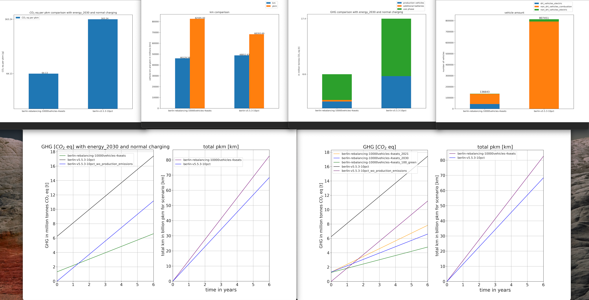

## introduction
This is the GIT repository to my corresponding bachelor thesis written at TU Berlin in 2022.
The program enables a user to compare two different MATSIM (https://www.matsim.org) simulation files, which simulate the transport within a region on a multi agent basis, with the main goal to automatically create a comparing life cycle assessment, in order to decide on ecological advantages.
At the end excel files are created which contain all calculated informations, additionally diagrams are created for e.g. total greenhouse gas emissions, necessary vehicle amount or total km comparison. As well as a detailed graphic which picture the emissions per year for each scenario in comparison, with an additional graphic showing different grid mixes.

The main goal of this bachelor thesis was to analyze whether a conversion to a fully electric mobility on demand system instead of privately owned cars would be beneficial in terms of greenhouse gas emissions, which could be succesfully shown with the help of this program.

# how to use
## before using the program
first you need to install all required packages, which you can do by executing the command:
"pip install -r requirements.txt"
Additionally you are going to need openLCA with the corresponding database for this bachelor thesis, or you can adjust the names for the systems in the code accordingly.

start the openLCA software and open the olca file linked with this particular project, then establish the openLCA connection via the IPC server connection for port 8080,
if you want to completly run the program, otherwise the program will calculate the scenarios, store the results and
throw an error message that no connection to openLCA could be established.

## using the program
after starting the program by running the command "python main.py" in any given code workspace a GUI window opens up where the user can adjust the different parameters.

additionally the user has to select the path to the matsim output results folders, which can be done by clicking the "open browser" button next to the text boxes.
if the user wishes to adjust vehicle parameters such as battery capacity or mass, he can click the button "Edit Vehicle Parameters", which opens another window, where the user can
specify mass, battery size and consumption for every vehicle size class.
if the uses wishes to procede with the standard values specified in "vehiclestandards.ini", he can click the button "restore standards".
now the user only has to press save parameters and close to get back to the main window.

after all parameters have been adjusted the user presses the "start script" button which triggers the batching process for each scenario separately, in which a list of the used vehicles
is beeing created and then the information, such as driven distance, road and speed percentages for each vehicle is returned.
afterwards averages for each scenario for DRT cars as well as normal passenger cars are calculated, which are then used for the life cycle asssessment.
before that happens, the results are scaled accordingly to the type of scenario which was put in.

after finishing the calculations comparing diagrams are created and saved into a new folder called lca/"current date".

